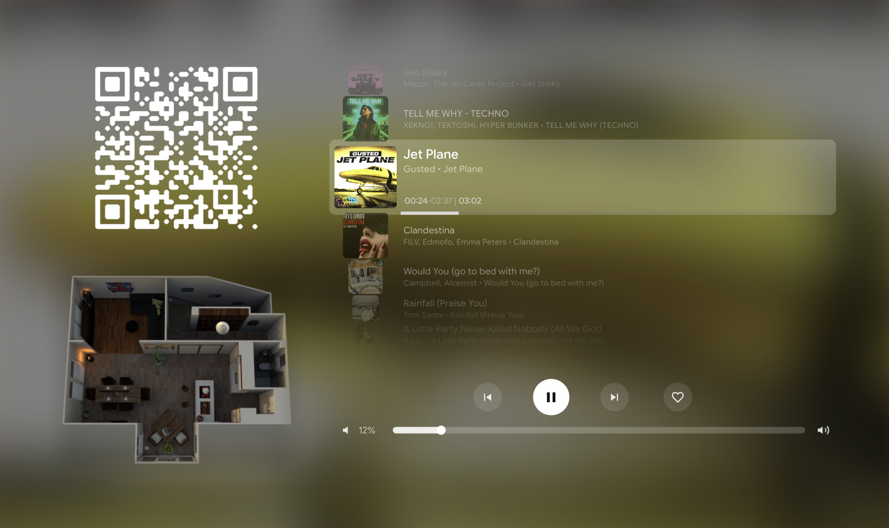

# 🎉 Home Assistant Party View

!!! Progressbar ist currentlich obly changing when play/pause button is pressed. I already have al solution with a nested mini-media-player card but i doesn't render good al the time) !!!

A full-screen Music Assistant Party Mode dashboard for Home Assistant tablets.  
Displays the current queue, album art as dynamic blurred background, player controls, volume slider, QR code and a floorplan thumbnail.



---

## Features

- **Dynamic background** — album cover from Music Assistant, blurred and brightened
- **Queue display** — 2 tracks before + 4 after current, with cover art scaled by distance
- **Player controls** — prev / play-pause / next / favourite, vertically centred
- **Volume slider** — touch-and-drag with `my-slider-v2`
- **QR Code** — links to Music Assistant party URL; falls back to placeholder when party mode is off
- **Floorplan thumbnail** — tap to navigate back to floorplan dashboard

---

## Requirements

### Home Assistant
- Home Assistant OS (tested on core-2026.x)
- [Music Assistant](https://music-assistant.io/) integration

### HACS Custom Cards
Install via HACS → Frontend:

| Card | Repository |
|------|-----------|
| `custom:button-card` | [custom-cards/button-card](https://github.com/custom-cards/button-card) |
| `custom:layout-card` | [thomasloven/lovelace-layout-card](https://github.com/thomasloven/lovelace-layout-card) |
| `custom:my-slider-v2` | [AnthonMS/my-cards](https://github.com/AnthonMS/my-cards) |
| `custom:gap-card` | [thomasloven/lovelace-gap-card](https://github.com/thomasloven/lovelace-gap-card) |

### Music Assistant Custom Service
The queue card uses `mass_queue.get_queue_items` — this requires the  
[Music Assistant HA Integration](https://github.com/music-assistant/home-assistant-addon) v2.x.

---

## Installation

### 1. Copy dashboard YAML

Open your dashboard in the HA UI (raw config editor) and paste the contents of  
[`party-view.yaml`](party-view.yaml) as a new **Panel View**.

Adjust these values to match your setup:

```yaml
entity: media_player.kuche_2          # Your Music Assistant media player
navigation_path: /floorplan-test/floorplan  # Your floorplan path (or any path)
/local/floorplan/00_Aus_Alles.png     # Your floorplan image
```

### 2. QR Code Python Script

See [`docs/qr-script.md`](docs/qr-script.md) for full setup instructions.  
The script connects to Music Assistant via WebSocket and generates a QR code PNG  
when party mode is active.

### 3. Automation

See [`docs/automation.md`](docs/automation.md) for the HA automation that  
triggers the script when party mode starts or ends.

---

## File Overview

```
ha-party-view/
├── README.md               # This file
├── party-view.yaml         # Dashboard YAML (paste into HA)
├── scripts/
│   └── party_qr.py         # QR code generator
├── automation/
│   └── party_mode.yaml     # HA automation
└── docs/
    ├── qr-script.md        # QR script setup guide
    ├── automation.md       # Automation setup guide
    └── customisation.md    # Layout & styling options
```

---

## Quick Start

1. Install HACS cards listed above
2. Paste `party-view.yaml` into a new Panel View on your dashboard
3. Adjust `media_player` entity and paths
4. Set up the QR script and automation (optional)
5. Open the view on your tablet

---

## Credits

Built for a Fire HD 10 tablet running Fully Kiosk Browser with Home Assistant and Music Assistant.
